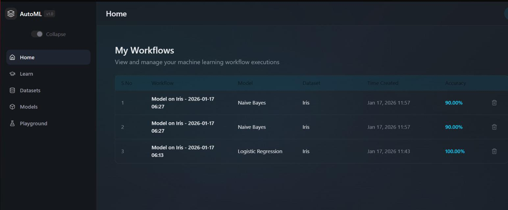
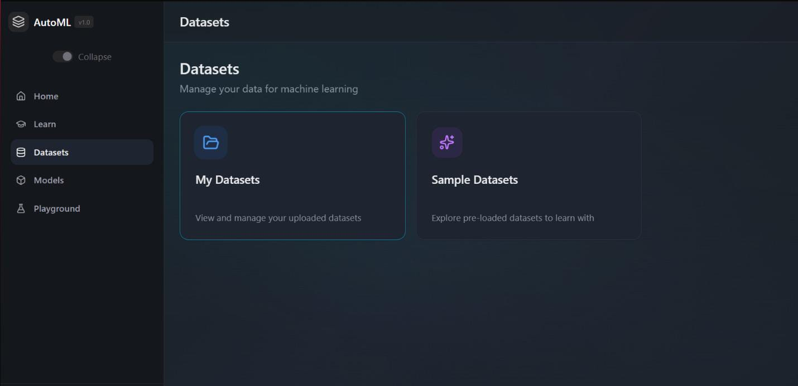
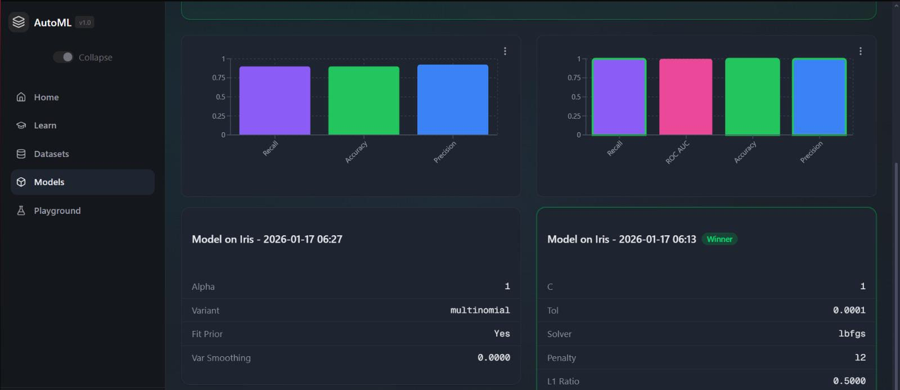
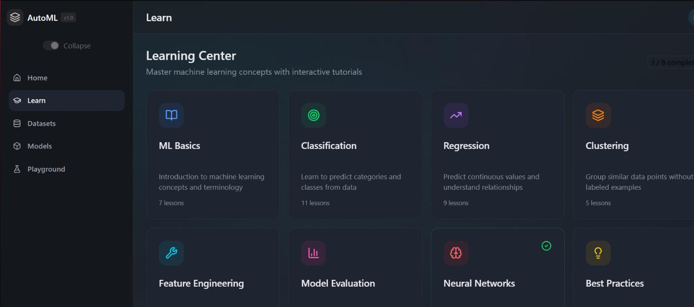

# Automated Machine Learning Platform for Beginners 

## 📌 Description

This project is an Automated Machine Learning (AutoML) platform designed to help beginners easily build machine learning models by automating data preprocessing, model selection, and evaluation.

## 👥 Team Project

This project was developed as a team effort along with my friends. I contributed to understanding the workflow, preprocessing, and testing of the system.

## 🚀 Features

* Upload dataset (CSV)
* Automatic preprocessing
* Model training and evaluation
* Beginner-friendly interface

## 🛠️ Tech Stack

* Python
* Pandas
* Scikit-learn

## ▶️ How to Run

1. Clone the repository
2. Install dependencies
3. Run the project

## 📸 Screenshots

### 🏠 Home Page

### 📊 Dataset Upload

### 🤖 Model Selection

### 📈 Learning / Training

### 🔄 Model Workflow
 

## 👨‍💻 Author

Rohit
